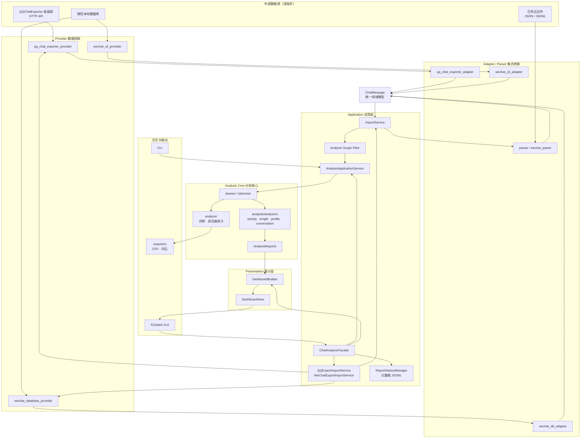

# Architecture

本文档是 Local Chat Analyzer 的**唯一架构事实来源**。

描述范围：当前已实现并通过测试的结构（v0.7.0 Desktop MVP Foundation）。
不包含未来路线图、环境搭建步骤和用户使用说明，参见第 9 节的文档边界。

---

## 1. 设计动机

项目要同时满足四个约束：

1. **隐私优先** —— 真实聊天记录只在用户本机处理，不出网络，不进日志。
2. **多来源** —— QQ、微信、本地导出文件，且后续还会增加。
3. **分析核心稳定** —— 新增来源不应该迫使分析逻辑改动。
4. **面向普通用户** —— 最终形态是桌面应用，而非命令行脚本。

这四条共同导出一个结论：**数据来源与分析逻辑必须彻底分离**。

分离的手段是引入统一领域模型 `ChatMessage`。所有来源先转换成它，
分析核心只消费它。于是来源的数量和格式差异被挡在核心之外，
核心不需要知道 QQ 与微信的任何区别。

GUI 带来第二个问题：界面若直接调用各个 Service，就会把来源判断、
配置组装、异常处理散落到控件代码里。为此引入 `ChatAnalyzerFacade`
作为应用层门面，GUI 只认识它一个入口。

---

## 2. 完整数据流



---

## 3. 依赖方向

箭头表示"允许依赖"，且**永不反向**。

```text
gui  ──▶  application/facade  ──▶  application/services  ──▶  analysis
                  │                        │                     │
                  │                        ├──▶ providers        ▼
                  │                        ├──▶ adapters    presentation
                  │                        └──▶ parsers          │
                  └──────────────────────────────────────────────┘
                          （facade 读取 presentation 产出）
```

两个容易被误读的事实：

- `presentation` 只依赖 `analysis` 的报告模型，不依赖任何其他层。
- `facade` 同时依赖 application 服务与 presentation，是唯一的汇聚点。
  这是刻意为之：把"调度 + 转换"的复杂度集中在一处，GUI 才能保持轻薄。

---

## 4. 各层职责

### 4.1 Provider

| | 内容 |
| --- | --- |
| 负责 | 与进程外数据源通信：HTTP 调用、token 读取、数据库定位与读取、导出任务创建与轮询；产出本地文件路径或原始记录 |
| 不负责 | 格式转换、分析、过滤、业务编排、面向用户的错误措辞 |
| 可依赖 | 标准库、HTTP 客户端、自身模块 |
| 禁止依赖 | `analysis/`、`presentation/`、`gui/`、`application/`、`ChatMessage` |

Provider 是唯一允许触碰外部世界的层。它不理解聊天语义，
只负责"把数据拿到本机"。

### 4.2 Adapter / Parser

| | 内容 |
| --- | --- |
| 负责 | 把某一种具体格式转换为 `ChatMessage` |
| 不负责 | 数据获取、分析、过滤策略、文件发现 |
| 可依赖 | `message.py`、标准库 |
| 禁止依赖 | `analysis/`、`presentation/`、`gui/`、`providers/` |

Adapter 与 Parser 属于**同一层的两种形态**：

- **Adapter** 处理 Provider 产出的外部数据格式。
- **Parser** 处理用户手上已有的导出文件。

两者输出都是 `ChatMessage`，都不得依赖分析核心。
新增来源时不要复制现有 parser，各来源使用独立模块。

### 4.3 ChatMessage

| | 内容 |
| --- | --- |
| 负责 | 作为跨层唯一领域模型，表达一条与来源无关的聊天消息 |
| 不负责 | 展示名称解析、统计、格式化、平台特有字段 |
| 可依赖 | 标准库 |
| 禁止依赖 | 其他任何业务层 |

`ChatMessage` 是 `frozen=True, slots=True`，**视为冻结契约**。
新增展示需求不通过扩展它来满足（见 5.4 名称注入）。

2026-08 人工批准一次向后兼容的最小扩展：`conversation_type`
（`private` / `group` / `unknown`）与 `is_self`（`True` / `False` / `None`）
作为跨平台分析所需的最小 identity semantics 进入 `ChatMessage`；
`None` 表示数据源无法可靠判断本人，展示层仍通过名称注入与
`resolved_display_name` 解析，不复制平台身份规则。
关于 `sender_id`、`conversation_type`、`is_self` 的平台映射、canonical identity
与 Unknown 语义，以根目录 `DATA_SEMANTICS.md` 为唯一事实来源；本文只定义其架构职责。

### 4.4 Application

应用层含四类组件，职责各不相同。

**ImportService** —— 路径校验、文件发现、来源识别、parser/adapter 路由。
它直接引用全部 parser 与 adapter，是格式识别的集中点。
不做分析，不做导出。

**来源编排服务** —— `QQExportImportService`、`WeChatExportImportService`。
把"先导出、再导入"串起来，并提供会话列表查询。
它们是 Provider 的唯一合法调用者。

**来源连接服务** —— `QQConnectionService`。把 Provider 的健康检查与凭据状态
翻译成用户可理解的 `QQConnectionStatus`（是否可用、QCE 是否运行、是否已授权、
下一步操作提示）。它是应用层内 Provider 的合法调用者之一；GUI 通过 Facade
获取状态，不直接接触 Provider。

**导出任务管理** —— `ExportTaskManager`。把 QCE 底层 `ExportTask` 快照与
Provider 异常翻译成用户层 `ExportTaskStatus`（创建 / 导出中 / 完成 / 失败 /
已取消），不复制 Provider 的轮询逻辑。当前为轻量应用层封装，不引入异步框架；
Facade 在后续阶段接入。

**运行时管理** —— `QQRuntimeManager`。负责检测、启动、停止外部 QQ 采集
运行环境，并把底层异常转换成用户层 `QQRuntimeStatus`。它只依赖
`runtime/` 的 `ChatRuntime` 协议，不解析外部工具输出，也不接触 Provider
的 HTTP 通信。启动流程包含就绪等待：进程拉起后由 Runtime 探测健康端点，
确认可用后才进入 `RUNNING`。

**运行时实现** —— `BundledQQRuntime` 与 `QQRuntimeConfig`。配置承载
`executable_path`、`working_directory`、`base_url`、`config_directory` 与
`security_path`；实现负责进程启动、停止、状态与 `wait_ready()` 健康探测，
不复制 Provider 的业务解析。

**AnalysisApplicationService** —— 业务流程编排：
调用 ImportService 取得消息，按本次请求应用 Analysis Scope Filter，
再 driving 清洗、分词、分析，
组装 `AnalysisResultDTO` 与 `AnalysisReports`，触发导出。

**Analysis Scope Filter** —— 应用层的单次分析时间范围过滤：
只读取 `ChatMessage.timestamp`，支持全部、最近一年、最近半年和自定义日期范围。
过滤发生在 ImportService 之后、现有智能过滤和 Analyzer 之前；Analyzer 不感知范围配置。
“全部”模式直接保留原消息，指定范围过滤为空时在进入 Analyzer 前返回应用错误。

**ReportHistoryManager** —— 结果层的分析历史元数据存储：
只在分析结果与 Dashboard view 成功生成后由 Facade 调用，保存分析 ID、时间、
来源、会话标识、消息数量与分析范围到用户数据目录中的 JSONL 文件。
不保存聊天正文、原始消息、`AnalysisReports` 或 Dashboard 快照；读取损坏文件时
返回空历史并记录日志，保存失败不改变本次分析成功结果。

| | 内容 |
| --- | --- |
| 负责 | 流程编排、DTO 转换、应用级错误 |
| 不负责 | 具体统计算法、文件格式解析、界面措辞 |
| 可依赖 | `providers/`、adapters、parsers、`analysis/`、`message.py` |
| 禁止依赖 | `gui/` |

### 4.5 Analysis Core

| | 内容 |
| --- | --- |
| 负责 | 全部统计与分析算法，输入 `ChatMessage`，输出报告模型 |
| 不负责 | 文件读写、数据获取、格式化展示、平台判断 |
| 可依赖 | `message.py`、`rich_message.py`（P0 source-neutral 旁路输入）、标准库、算法类第三方库 |
| 禁止依赖 | `application/`、`presentation/`、`gui/`、`providers/`、adapters、parsers |

核心分两代，并存且互不干扰：

- **v1**：`cleaner.py`、`tokenizer.py`、`analyzer.py` —— 词频、说话者统计。
- **v2/v3**：`analysis/` 包 —— 活跃度、消息长度、用户画像、会话概览、
  Conversation Sessions 等结构化分析能力。

**Conversation Sessions** 位于 Analysis Core 内部，只消费统一后的
`ChatMessage.timestamp`、`conversation_type`、`is_self` 与稳定发送者身份。
Session 切分、initiator 判定和汇总统计必须在核心完成；
Presentation 与 Echo 只消费结果，不得重新计算。

**Rich 能力（Expression v1）** 可选消费 `rich_message.py` 中的 source-neutral
content part（如 `ExpressionContent`），作为 `ChatMessage` legacy 文本投影之外
的旁路输入。`ImportOutcome.rich_messages` 只在来源 adapter 已支持 Rich 语义时
填充；Analysis 仍不得出现平台字段或来源分支。

**禁止在核心中出现平台分支。** 不得出现 QQ、微信、`wxid`、`chatroom` 之类判断。
唯一例外是 `analysis/models.py` 中对内部标识可展示性的判定，
那是展示语义规则而非来源分支（见 5.4）。

### 4.6 Presentation

| | 内容 |
| --- | --- |
| 负责 | 格式转换、标题与描述生成、排序截断、图表数据组装 |
| 不负责 | **任何统计计算**、数据获取、控件创建 |
| 可依赖 | `analysis/` 的报告模型、标准库 |
| 禁止依赖 | `gui/`、Qt、任何 GUI 框架、`providers/`、adapters |

展示层是纯函数式的转换层。它拿到的数字必须已由 analyzer 算好，
自己只做"怎么说给人听"。产出 `DashboardView`，其中包含
`MetricCard`、`UserCard`、`ConversationCard`、`ChartData`。

`DashboardView` 不暴露 `AnalysisReports` 内部结构，GUI 只面对视图模型。

### 4.7 Facade

| | 内容 |
| --- | --- |
| 负责 | 来源选择与分派、配置整理、Service 调度、异常统一、返回展示模型 |
| 不负责 | 统计、解析、控件创建、数据获取细节 |
| 可依赖 | application 各服务、`presentation/` |
| 禁止依赖 | `gui/` |

`ChatAnalyzerFacade` 是 **GUI 的唯一入口**。对外 API：

- `list_sources()` → `tuple[SourceInfo, ...]`，含可用性标记
- `list_sessions(source)` → `list[SessionInfo]`，统一 QQ 与微信差异
- `get_connection_status(source)` → `QQConnectionStatus`，返回来源连接状态
- `list_analysis_history()` → `tuple[AnalysisHistoryRecord, ...]`，返回元数据历史
- `get_analysis_history(analysis_id)` → `AnalysisHistoryRecord | None`
- `analyze_file(path, config)` → `AnalysisOutcome`
- `analyze_session(source, session_id, config)` → `AnalysisOutcome`

两条重要约定：

1. **异常在此归一。** 底层异常统一转换为 `FacadeError`，
   携带 `code` 与 `public_message`。GUI 只展示 `public_message`，永不展示 traceback。
2. **中间文件对 GUI 不可见。** `analyze_session` 内部会产生导出文件，
   但这属于实现细节，不出现在返回值与 API 语义里。

依赖注入构造（`qq_service`、`wechat_service`、`analysis_service`、
`presentation_builder`、`report_history_manager`），测试可传入 stub。

### 4.8 GUI

| | 内容 |
| --- | --- |
| 负责 | 控件装配、事件转发、状态展示（空 / 进行中 / 成功 / 错误） |
| 不负责 | 读数据库、解析文件、调用 Provider、任何统计计算 |
| 可依赖 | `application/facade.py`、`presentation/` 的视图模型、PySide6 |
| 禁止依赖 | `providers/`、parsers、adapters、`analyzer.py`、`tokenizer.py`、`cleaner.py`、`sqlite3` |

GUI 层零业务逻辑。所有报告展示控件为只读
（`setEditTriggers(NoEditTriggers)`），但保留选中与复制能力。
分析成功后只在现有状态栏展示历史保存成功或失败；不直接读取历史文件，
也不提供历史报告恢复页面。

### 4.9 CLI

| | 内容 |
| --- | --- |
| 负责 | 命令参数解析、用户交互、结果显示、退出码 |
| 不负责 | 分析流程、Provider 构造、格式解析 |
| 可依赖 | `application/` |
| 禁止依赖 | `providers/`、核心分析模块 |

CLI 与 GUI 是同层的两个交互适配器，共享同一套应用服务，
**不允许存在两套业务逻辑**。

### 4.10 Exporter

| | 内容 |
| --- | --- |
| 负责 | 生成本地产物：词频 CSV、词-说话者 CSV、词云图、Top 说话者图 |
| 不负责 | 统计计算、数据获取 |
| 可依赖 | 分析结果、绘图与字体库 |
| 禁止依赖 | `gui/`、`providers/`、`application/` |

---

## 5. 核心设计原则

每条给出原则、理由与违例信号，便于在 review 中实际检查。

### 5.1 单向依赖

依赖只能由外层指向内层，核心永不感知外层。

理由：核心稳定性是多来源支持的前提。

违例信号：`analysis/` 中出现 `from ..application import ...`。

### 5.2 ChatMessage 是唯一跨层领域模型

所有来源统一转换为它，核心只消费它。

理由：把来源差异挡在核心之外，新增来源不改核心。

违例信号：平台专用模型进入 `analysis/`；为了展示需求去改 `ChatMessage` 字段。

Rich 能力阶段允许 `ImportOutcome` 额外携带 `rich_messages` 作为旁路通道，
供 Analysis Core 可选消费；`ChatMessage` 仍是 legacy text projection 的稳定入口，
禁止用 Rich 数据反向补全 `ChatMessage`，也禁止平台字段进入 `analysis/`。

### 5.3 来源与分析隔离

分析核心不知道 QQ、微信、本地文件的存在。

理由：来源会持续增加，分析算法不应随之膨胀。

违例信号：`analyzer.py` / `tokenizer.py` / `cleaner.py` / `analysis/` 中出现平台判断。

### 5.4 展示名称由调用方注入

这是 v0.7.0 的关键决策，单列说明。

问题：分析结果里的 `sender` 可能是 `wxid_xxx`，`conversation_id` 可能是
`xxx@chatroom`，用户无法理解。但 `ChatMessage` 不可改，
分析核心又不允许认识微信。

解法：名称映射由**调用方经 DTO 注入**。
`AnalysisRequestDTO` 提供 `speaker_names` 与 `conversation_names`
（`Mapping[str, str]`，默认空），`AnalysisApplicationService` 透传给
`UserProfileAnalyzer` 与 `ConversationAnalyzer`。

报告模型提供 `display_name` 字段与 `resolved_display_name` 属性，
展示层只读后者。三级 fallback：

```text
display_name 非空            →  display_name
conversation_id 可展示       →  conversation_id
否则                         →  UNKNOWN_CONVERSATION_NAME（未知会话）
```

不可展示的内部标识：含 `@chatroom`，或以 `wxid_` 开头。

**未注入映射时，行为与注入机制引入前完全一致**（回退到原始 key），
因此该机制对既有调用方无侵入。

两个隐私约束：`speaker_names` / `conversation_names` 在 DTO 中标记
`repr=False`，避免真实昵称随 repr 泄露到日志。

### 5.5 GUI 无业务逻辑

GUI 只装配控件、转发事件、展示状态。

理由：业务逻辑一旦进入控件，就无法被测试，也无法被 CLI 复用。

违例信号：`gui/` 中出现 `sqlite3`、Provider 导入、循环求和统计。

### 5.6 异常在 Facade 归一

底层异常不穿透到界面，统一转为 `FacadeError`。

理由：用户看 traceback 没有意义；界面也不应该认识每种底层异常。

违例信号：GUI 中 `except` 捕获 Provider 或 Service 的具体异常类型。

### 5.7 隐私优先贯穿各层

原始聊天内容只在本机处理，不出网络。DTO 对敏感字段使用 `repr=False`，
摘要模型不保存正文与消息列表，测试只用虚构数据。

违例信号：日志或终端输出完整正文；测试引入真实导出文件。

---

## 6. 模块映射

以下为当前代码的真实结构。

| 目录 / 模块 | 架构层 |
| --- | --- |
| `providers/qq_chat_exporter_provider.py` | Provider |
| `providers/wechat_database_provider.py` | Provider |
| `providers/wechat_cli_provider.py` | Provider |
| `qq_chat_exporter_adapter.py` | Adapter |
| `wechat_db_adapter.py` | Adapter |
| `wechat_cli_adapter.py` | Adapter |
| `parser.py` | Parser（QQ 导出文件） |
| `wechat_parser.py` | Parser（微信导出文件） |
| `message.py` | 领域模型 ChatMessage |
| `application/import_service.py` | 导入编排 |
| `application/import_request.py` / `import_outcome.py` / `import_result.py` | 导入契约 |
| `application/export_task_manager.py` | 导出任务管理（QQ） |
| `application/qq_export_import_service.py` | 来源编排（QQ） |
| `application/qq_connection_service.py` | 来源连接状态（QQ） |
| `application/runtime/qq_runtime_manager.py` | 外部运行时管理（QQ） |
| `application/wechat_export_import_service.py` | 来源编排（微信） |
| `application/analysis_service.py` | 应用服务 |
| `application/scope_filter.py` | 单次分析时间范围过滤 |
| `application/report_history.py` | 分析历史元数据 JSONL 存储 |
| `application/dto.py` / `errors.py` / `task.py` / `export_config.py` | 应用契约 |
| `application/facade.py` | Facade |
| `runtime/` | 外部运行时契约（ChatRuntime）与捆绑运行时实现（BundledQQRuntime） |
| `cleaner.py` / `tokenizer.py` / `analyzer.py` | Analysis Core v1 |
| `analysis/models.py` | 报告模型（v2/v3） |
| `analysis/analyzers/*.py` | 独立分析器 |
| `analysis/conversation_sessions.py` | Conversation Sessions 切分与汇总分析 |
| `analysis/identity.py` | 稳定发送者 identity 辅助 |
| `analysis/peaks.py` / `timestamps.py` | 分析辅助 |
| `presentation/models.py` | 视图模型 |
| `presentation/builders.py` / `formatters.py` | 视图构建与格式化 |
| `gui/main_window.py` / `analysis_page.py` / `dashboard_page.py` | GUI 界面 |
| `gui/app.py` / `__main__.py` / `workers.py` | GUI 启动与执行 |
| `cli.py` | 交互适配（CLI） |
| `exporters.py` | 输出适配 |
| `detectors/*.py` / `smart_profile.py` / `filter_pipeline.py` / `filter_decisions.py` / `candidates.py` / `decision_engine.py` | 智能过滤子系统 |

两处需要如实说明的结构现状：

1. **三个 Adapter 位于包根目录，没有 `adapters/` 子包**，
   与 `providers/` 的组织方式不一致。属历史结构差异，不影响依赖方向。
2. **Facade 位于 `application/` 而非独立顶层包**，
   因其本质是应用层的门面，而不是新的一层业务。

---

## 7. 扩展指南

### 7.1 新增聊天来源

1. 先阅读真实导出样例，确认字段结构；只支持第一种格式，不预先支持所有变体。
2. 若需进程外获取，在 `providers/` 新增 provider 模块。
3. 新增独立 adapter 或 parser，输出 `ChatMessage`；**不要复制现有 parser**。
4. 在 `ImportService` 注册识别与路由。
5. 若需"先导出再导入"，新增 `XxxExportImportService`。
6. 在 `ChatSource` 枚举与 Facade 分派中登记。
7. 先写虚构数据测试，再实现。

**不许修改**：`analyzer.py`、`tokenizer.py`、`cleaner.py`、`analysis/`、
`presentation/`、`gui/`、`message.py`。

验收标准：分析核心的代码与测试零改动，全量测试通过。

### 7.2 新增分析能力

1. 在 `analysis/models.py` 新增 frozen dataclass 报告模型。
2. 在 `analysis/analyzers/` 新增独立 analyzer，入参为 `ChatMessage` 序列。
3. 在 `AnalysisReports` 新增字段，给默认值以保证向后兼容。
4. 在 `AnalysisApplicationService._build_reports()` 接线。
5. 若需展示，再到 `presentation/` 增加对应视图模型与构建逻辑。

需要 Rich 语义的新分析器（如 Expression v1）可额外接收 `ImportOutcome.rich_messages`
中的 source-neutral `RichMessage`；该通道默认空元组，旧分析器不感知。

**不许**把新统计塞进 `analyzer.py`；
**不许**在 analyzer 内读文件、分词或访问网络。

### 7.3 新增展示方式

1. 在 `presentation/models.py` 新增视图模型，在 `builders.py` 做转换。
2. **不许在展示层重新计算统计** —— 需要的数字应先在 analyzer 中产出。
3. 新界面（Web、报告导出等）作为 Facade 的新调用者接入，
   不绕过 Facade 直接调用 Service。

---

## 8. 架构不变量

以下规则可被机械检查，新增层时应同步补守护测试。

```text
1. analysis/     不 import application | presentation | gui | providers | adapters | parsers
2. presentation/ 不 import gui | PySide6 | providers | adapters
3. gui/          不 import providers | parser | wechat_parser | analyzer
                 | tokenizer | cleaner | sqlite3
4. gui/          除 facade 外不 import application 的其他模块
5. 核心分析模块  不出现 wxid / chatroom / qq / wechat 平台分支
6. 报告与 DTO    敏感字段不进入 repr
7. 测试          不读取真实聊天数据
```

其中若干条已由现有测试守护（如 GUI 不导入 provider、
展示层不依赖 Qt、DTO 敏感字段不泄露）。

---

## 9. 文档边界

本文档只讲架构。其他内容各有归属：

| 内容 | 归属文档 |
| --- | --- |
| 进度、版本节点、Roadmap | `PROJECT_STATUS.md` |
| 环境搭建、测试命令、Git 流程 | `DEVELOPMENT.md` |
| AI 协作规范 | `AGENTS.md` |
| 项目简介与快速上手 | `README.md` |
| 跨平台字段、identity 与分析语义 | `DATA_SEMANTICS.md` |
| 当前稳定能力、冻结区域与近期工作 | `DEVELOPMENT_STATE.md` |
| 历史设计记录 | `docs/design/`、`docs/superpowers/specs/` |

当架构描述与其他文档冲突时，**以本文档为准**。

---

## 10. Connection Layer

记录 Phase 10 新增的连接层。它回答一个问题：
“这个来源现在能不能用”。

- **GUI 不管理 runtime 生命周期。**
  界面不再启动运行环境、不做健康检查、不检查 token，
  只负责展示状态、触发连接动作、展示错误。
- **Facade 提供连接状态。**
  GUI 仍然只认识 `ChatAnalyzerFacade` 一个入口，
  通过 `get_qq_connection_snapshot()` 和 `connect_qq()` 获取结果。
- **Connection Manager 管理连接流程。**
  位于 `application/connection/`，负责编排准备、启动与授权检查，
  并把底层结果解释成用户可理解的状态。
- **ConnectionSnapshot 是只读状态模型。**
  不可变，跨层传递，GUI 只读取不重新推导。
  状态取值：`DISCONNECTED`、`INITIALIZING`、`STARTING`、
  `WAITING_AUTH`、`CONNECTED`、`ERROR`。
- **当前仅 QQ 使用该结构。**
  未来微信可以复用同一套抽象，但**不提前实现**；
  微信仍走原有连接状态路径。

调用链：

```text
GUI
 ↓
Facade
 ↓
Connection Manager
 ↓
QQ Connection Service / Runtime
```

### 10.1 GUI 连接体验状态

连接页只把 Facade 已有状态映射为展示状态，不新增 Provider 状态，也不在 GUI
重新判断连接是否成功：

| 展示状态 | 会话区域 | 可用操作 |
| --- | --- | --- |
| 未连接 | “暂无会话；连接数据源后，这里会显示聊天记录” | 连接当前来源、返回数据源选择 |
| 连接中 / 等待登录 | “正在连接数据源...” | 取消当前连接任务、返回数据源选择 |
| 数据读取中 | “正在读取聊天数据...” | 返回数据源选择 |
| READY | Facade 返回的真实会话列表 | 选择会话、返回数据源选择 |

QQ 与微信的页面状态互相隔离。切换来源或返回数据源选择时，GUI 清空上一来源的
状态文字、会话缓存、搜索条件和引导控件；迟到的异步回调不得更新当前来源页面。
“返回数据源选择”只放弃当前 GUI 流程，不代表登出、断开或关闭 QQ/微信客户端。
分析中的取消仍沿用原分析取消流程。
