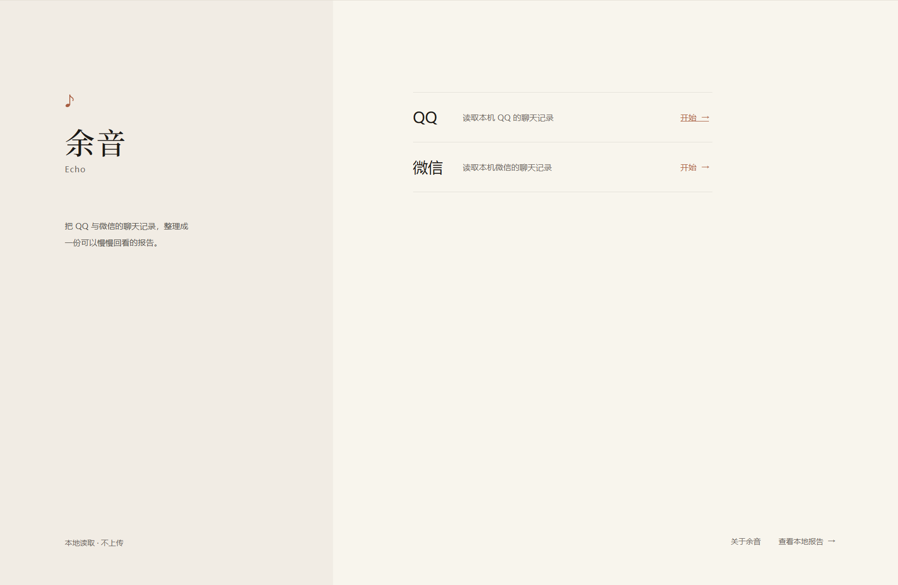
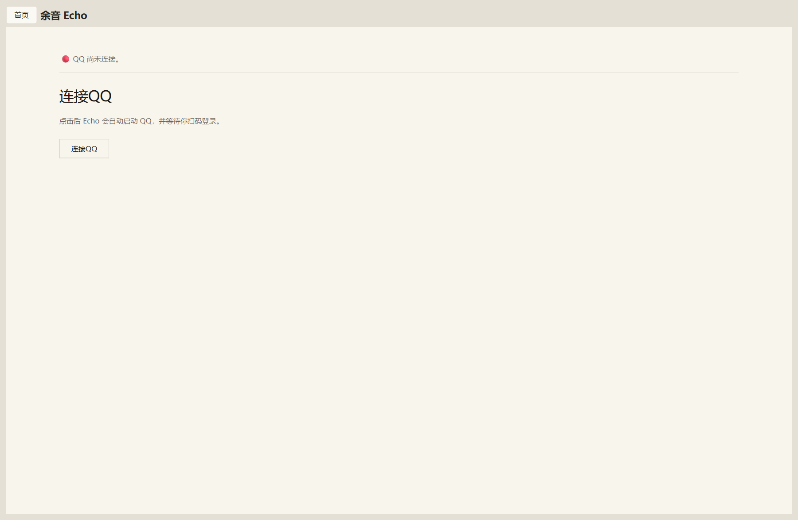
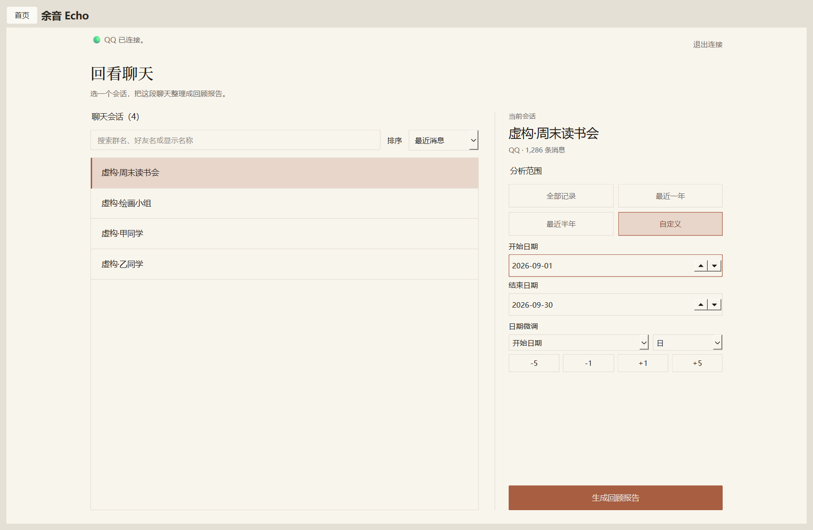

# 余音 Echo

> 隐私优先、完全本地运行的 QQ / 微信聊天分析工具。  
> 把散落在聊天记录里的时间、语言与互动，重新整理成一份可以回看的 Echo Report。

## 现在能看到什么

- 会话概览：消息规模、时间跨度、活跃时段
- 聊天轮次：谁更常开启聊天、一次通常聊多久、聊天纪录
- 节奏：一天与一周中的活跃分布
- 语言画像：
  - 群聊成员特色词
  - 私聊双方常用表达
- QQ / 微信统一分析
- 表达习惯（Expression）：Emoji、已支持的 QQ / 微信表情的频率、组合与相邻用词
- 自包含 Echo HTML 报告，可直接在浏览器打开

完整 Sticker / 表情包语义与 Reply / 引用回复分析计划在后续版本支持。

## 当前状态

Echo v0.1.0 是首个计划公开的 Windows MVP，目前仍在发布前 Hardening，**尚未正式发布**。
当前发布阻断项、验收状态与剩余待办统一由 [Hardening 工作地图](docs/HARDENING.md) 管理。

0.1.0 之后的长期产品目标和暂定版本主题见 [Echo Product Roadmap（0.1.0 → 1.0.0）](docs/ROADMAP.md)。

## 界面预览

以下截图使用虚构演示数据，不含真实聊天记录或账号信息。

| 主界面 | QQ 连接页 |
| --- | --- |
|  |  |
| 会话选择与分析配置 | Echo Report 会话概览 |
|  |  |

## 开源许可

Echo 自有且有权授权的源代码采用 [Mozilla Public License 2.0](LICENSE)，
许可范围与源码获取方式见 [Echo 许可声明](NOTICE.md)。
官方 Echo 免费、非商业运营；MPL 2.0 本身允许商业使用，这一运营方式不构成对 MPL 权利的额外限制。
NapCat 和其他第三方组件仍受各自许可证约束，见 [第三方版权声明](third_party/napcat/NOTICE.md)
及 [NapCat Issue #2096](https://github.com/NapNeko/NapCatQQ/issues/2096)。
公开源码仓库：[lingmeng-658/echo-chat-analyzer](https://github.com/lingmeng-658/echo-chat-analyzer)。

## 隐私优先

Echo 的设计前提是：真实聊天数据属于用户自己。

- QQ / 微信聊天数据在本机读取和分析
- 不上传聊天记录
- 不将聊天正文、身份信息、群号或本地路径写入 Git
- 测试只使用虚构数据
- Echo 报告可以在本地生成并查看

## 支持的数据来源

### QQ

正式链路为 NapCat → Direct DB → `qq_db_adapter` → 统一消息模型 → Analysis。
NapCat 负责启动 / 登录和本地解密，Direct DB 负责会话查询与消息获取。
QQChatExporter（QCE）已完全退休：不再支持其 runtime、CLI 服务调用、QCE JSON，
也不再支持旧 QQ JSON / JSONL 文件兼容或 QCE fallback。

### 微信

支持在 Windows 本机读取微信数据库，与 QQ 使用同一套分析能力。

### 本地文件 CLI

`echo-chat` 保留为当前支持格式的本地文件分析入口：`qq-db-json`、`wechat-db-json`、
`detailed-json`、`chatlab-jsonl` 和 `cli-json`（符合微信 CLI schema 的 bare array）。
它不再提供 `qce list` / `qce analyze`，也不导入 QCE 或旧 QQ 导出文件。

## Echo Report

Echo 不希望成为另一张 Dashboard。

它更接近一份数字聊天杂志：

- 用编辑式排版组织数据
- 保留适量音乐意象
- 重点展示“这段聊天留下了什么”

## Desktop

Windows 桌面端当前支持：

- QQ / 微信入口与连接
- 会话选择与时间范围设置
- 启动分析并打开 Echo Report
- Local Data 本地报告管理：搜索、重新打开、删除所选 / 保留所选删除其余 / 删除全部报告，
  并显示报告数量与占用空间
- 「关于余音」对话框与手动检查更新：仅查询并打开官方 GitHub Release 页面

报告不会自动淘汰，只由用户在 Local Data 显式删除；删除报告不会删除
QQ / 微信原始聊天数据或用户另存的文件。
检查更新只提示并打开官方 Release 页面，不自动下载、安装或覆盖。
v0.1.0 首次发布只提供 Windows Portable ZIP，不提供 Setup 安装器；
安装器与原地覆盖更新机制统一延期。

## 开发运行

项目使用 Python `src` layout。

在仓库根目录执行：

```powershell
.\.venv\Scripts\Activate.ps1
pip install -e ".[gui,dev]"
echo-gui
```
